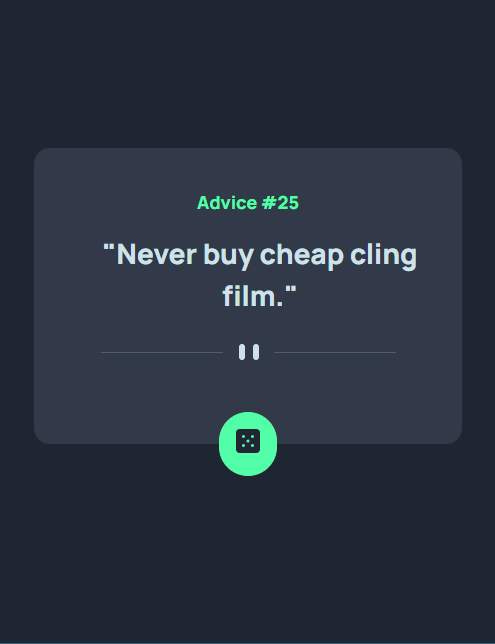
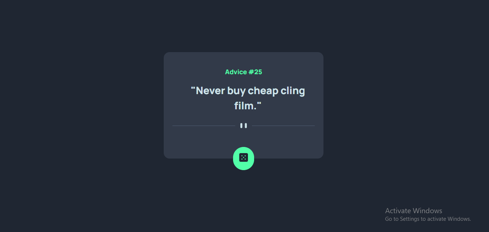

# Advice-Generator
# Frontend Mentor - Advice generator app solution  This is a solution to the [Advice generator app challenge on Frontend Mentor](https://www.frontendmentor.io/challenges/advice-generator-app-QdUG-13db). Frontend Mentor challenges help you improve your coding skills by building realistic projects. 

## Table of contents 

- [Overview](#overview)   
- [The challenge](#the-challenge)   
- [Screenshot](#screenshot)   
- [Links](#links) 
- [My process](#my-process)   
- [Built with](#built-with)   
- [What I learned](#what-i-learned)  
- [Continued development](#continued-development)   
- [Useful resources](#useful-resources)
- [Author](#author)
- [Acknowledgments](#acknowledgments)   

## Overview  ### The challenge  Users should be able to:  - View the optimal layout for the app depending on their device's screen size - See hover states for all interactive elements on the page - Generate a new piece of advice by clicking the dice icon 

### Screenshot  

 

### Links  
- Solution URL: [Add solution URL here](https://your-solution-url.com) 
- Live Site URL: [Add live site URL here](https://your-live-site-url.com) 

## My process  ### Built with  
- CSS custom properties - Flexbox
- Mobile-first workflow 
- [React](https://reactjs.org/)
- JS library - [TailwindCSS](https://tailwindcss.com/) - For styles   

### What I learned  The challenge was really helpful i have to make use of React skills. I have to work with a  Backend. I added the API to my React Design and it really work fine.    To see how you can add code snippets, see below:      

## Author 
- Website - [Add your name here](https://www.your-site.com) 
- Frontend Mentor - [@walay](https://www.frontendmentor.io/profile/walay) 
- Twitter - [@holar102](https://www.twitter.com/holar102)
